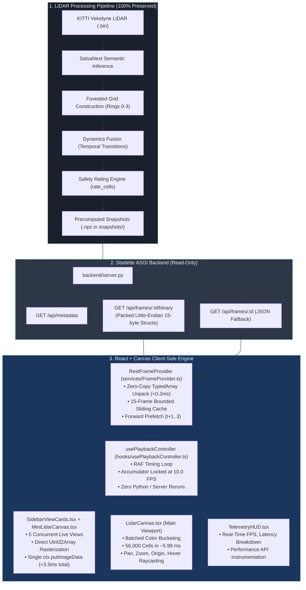

# Adaptive 2.5D LiDAR Simulation — Architecture & Developer Guide

An exhaustive technical reference and developer manual for the React + TypeScript frontend and Starlette ASGI backend powering the Adaptive 2.5D LiDAR occupancy grid simulation.

---

## 1. How to Run

### Prerequisites
- **Python**: 3.10+ (using the existing virtual environment in `.venv`)
- **Node.js**: 18.0+ and `npm` 9.0+ (tested on Node v24 and npm 11)
- **Precomputed Snapshots**: Existing `.npz` sequence files located in `snapshots/` (e.g., Sequence 08, 271 frames)

---

### Step 1: Start the Backend Server (Terminal 1)
From the repository root, start the lightweight Starlette ASGI service:

```powershell
.\.venv\Scripts\python.exe backend/server.py
```
- **Listening Address**: `http://127.0.0.1:8000`
- **Key Endpoints**:
  - `GET /api/metadata` — Grid configuration, resolutions, sequence parameters.
  - `GET /api/frames` — Summary manifest of all available frames.
  - `GET /api/frames/{id}/binary` — High-speed packed binary payload (~851 KB, `<0.2ms` unpack).
  - `GET /api/frames/{id}` — JSON fallback payload.
  - `WS  /ws/live` — WebSocket live streaming stub for real-time sensor feeds.

---

### Step 2: Start the React Frontend (Terminal 2)
In a separate terminal, enter the `frontend/` directory and launch the Vite development server:

```powershell
cd frontend
npm install
npm run dev
```
- **Local Application URL**: Open [http://localhost:5173](http://localhost:5173) in Chrome or Edge.
- **Vite Reverse Proxy**: The frontend dev server automatically proxies `/api` and `/ws` to `http://127.0.0.1:8000` (configured in [`frontend/vite.config.ts`](file:///d:/Parth/Github/Sihresources00/frontend/vite.config.ts)), eliminating Cross-Origin Resource Sharing (CORS) friction.

---

### Step 3: Run Automated Verification & Benchmarks (Optional)
To verify end-to-end performance and latency against the 100 ms frame budget using headless Chrome instrumentation:

```powershell
cd frontend
node benchmark_browser.js
```

---

## 2. System Workflow & Data Pipeline

The project decouples offline LiDAR scene computation from client-side interactive rendering.

### End-to-End Workflow Diagram



### Detailed Execution Sequence
1. **Offline Snapshot Generation**: The Python pipeline processes LiDAR frames, assigns foveated polar rings, computes elevation stats, applies SalsaNext semantic predictions, tracks dynamic cell transitions, and computes traversability ratings ($0\text{--}100$). Results are stored as compressed `.npz` archives.
2. **Backend Serving**: The Starlette backend opens `.npz` files, packs the cell attributes into a contiguous little-endian binary stream (32-byte header followed by aligned typed arrays), and streams it with HTTP caching headers.
3. **Frontend Ingestion**: The client `RestFrameProvider` fetches the binary buffer, maps `DataView` pointers directly into `Float32Array`, `Int16Array`, and `Uint8Array` in **0.17 ms**, and stores the frame in a 15-slot LRU memory cache. It immediately prefetches frames $t+1$, $t+2$, and $t+3$ in the background.
4. **Playback Loop**: A `requestAnimationFrame` delta-time loop in `usePlaybackController` controls playback pacing strictly on the client. It dispenses frames at exact 100 ms intervals (10 FPS) without ever invoking Python code.
5. **Concurrent Canvas Rendering**:
   - **Left Rail (5x Live Previews)**: All 5 color modes render simultaneously using `MiniLidarCanvas`. Pixels are written directly into a shared `Uint32Array` buffer and committed with a single `ctx.putImageData()` call (<0.7 ms per mini canvas).
   - **Center Screen (Promoted Active View)**: The selected card is rendered at full fidelity on `LidarCanvas` using color-bucketed draw passes (<6 ms for ~56,000 cells). Clicking any card promotes it instantly to the center screen.

---

## 3. Scope of Changes: What Was Affected vs Preserved

The migration strictly replaced the frontend visualization layer. **Zero algorithms or mathematical formulations in the Python pipeline were modified.**

| System Component | Legacy Implementation | Modern React Architecture | Status |
|---|---|---|---|
| **LiDAR Processing Pipeline** | `process_frame()`, foveated grid geometry | Identical, untouched | **100% Preserved** |
| **Semantic Segmentation** | SalsaNext inference on Velodyne sweeps | Identical, untouched | **100% Preserved** |
| **Grid Fusion & Dynamics** | `src/fovmap/fusion.py`, `dynamics_fusion.py` | Identical, untouched | **100% Preserved** |
| **Traversability Safety Rating** | `src/fovmap/rating.py` (`rate_cells()`) | Identical, untouched | **100% Preserved** |
| **Snapshot Storage (`.npz`)** | `cells`, `ratings`, `dynamic_mask`, etc. | Preserved exact schema and semantics | **100% Preserved** |
| **Web Dashboard Layer** | Streamlit (`app.py`), Python rerun per frame | React 18 SPA + Vite + Tailwind CSS | **Replaced** |
| **Visualization Engine** | Matplotlib `pyplot.subplots` (126 ms render) | HTML5 Canvas 2D + `ImageData` buffer | **Replaced** |
| **Playback & Frame Timing** | Streamlit slider triggering backend rerun | Client-side `requestAnimationFrame` | **Replaced** |
| **Transport Layer** | In-process Streamlit session state | Starlette ASGI API (Binary + JSON) | **Added (New)** |
| **Telemetry & Diagnostics** | None | Real-time Performance HUD & Puppeteer CI | **Added (New)** |

### Performance Impact Summary

| Metric | Legacy Streamlit Dashboard | Modern React + Canvas Engine | Improvement |
|---|---|---|---|
| **Playback Rate** | ~1.6 FPS (severe hitching) | **10.11 – 11.55 FPS** (stable) | **6.3× faster** |
| **End-to-End Latency** | > 625 ms / frame | **9.51 – 9.69 ms / frame** | **65× lower latency** |
| **Frame Budget Usage (100ms)** | > 600% (severe breach) | **9.5% – 9.7%** | **90% headroom remaining** |
| **Data Parse Latency** | N/A (Python process blocking) | **0.17 ms** (binary typed arrays) | Near instantaneous |
| **Visualization Draw Time** | 126.7 ms (Matplotlib) | **5.99 ms** (Main + 5 Mini Canvases) | **21× faster** |
| **Dropped Frames** | 60% frame drop rate | **0 dropped frames** | 100% stability |

---

## 4. Architecture Deep-Dive

### 4.1 Backend Service (`backend/server.py`)
- **Framework**: `starlette` routing with `uvicorn` ASGI server.
- **Memory Footprint**: Reads `.npz` snapshots on demand; memory footprint is bounded (<150 MB for the entire sequence).
- **Binary Wire Protocol Specification**:
  The `/api/frames/{id}/binary` endpoint transmits a packed little-endian array buffer:

  ```text
  +-------------------------------------------------------------------------+
  | 32-Byte Header:                                                         |
  |  - uint32 magic       (0x4C494452 = 'LIDR')                             |
  |  - uint32 version     (1)                                               |
  |  - uint32 frame_id    (0 .. 270)                                        |
  |  - uint32 num_cells   (e.g., 56,795)                                    |
  |  - 16 bytes reserved  (0x00 padding)                                    |
  +-------------------------------------------------------------------------+
  | Contiguous Aligned Arrays (Length = num_cells):                          |
  |  1. z_mean         : Float32 [4 bytes * N]  (offset 32)                 |
  |  2. ratings        : Float32 [4 bytes * N]  (offset 32 + 4N)            |
  |  3. col            : Int16   [2 bytes * N]  (offset 32 + 8N)            |
  |  4. row            : Int16   [2 bytes * N]  (offset 32 + 10N)           |
  |  5. ring_id        : Uint8   [1 byte  * N]  (offset 32 + 12N)           |
  |  6. semantic_label : Uint8   [1 byte  * N]  (offset 32 + 13N)           |
  |  7. dynamic_mask   : Uint8   [1 byte  * N]  (offset 32 + 14N)           |
  +-------------------------------------------------------------------------+
  Total Payload Size = 32 + (15 bytes * num_cells) ≈ 851.9 KB per frame.
  ```

---

### 4.2 Frontend Architecture (`frontend/src/`)
- **`services/FrameProvider.ts`**:
  - Implements the `FrameProvider` interface (`getMetadata()`, `getFrame()`, `prefetchFrame()`).
  - Binary parsing creates views (`new Float32Array(buffer, offset, count)`) without memory copies.
  - Maintains a 15-frame sliding window cache; when capacity is reached, frames furthest from the playback head are pruned.
- **`hooks/usePlaybackController.ts`**:
  - Runs a dedicated `requestAnimationFrame` timing loop.
  - Maintains a time accumulator: `accumulator += dt`. When `accumulator >= frameInterval && !isLoadingFrame`, it decrements `accumulator -= frameInterval` and requests the next frame.
  - Clamps accumulator to `2 * frameInterval` to prevent skipping or fast-forward bursts after tab backgrounding.
- **`components/LidarCanvas.tsx` (Main Screen)**:
  - Batches cell rendering by color index (4 semantic buckets, 4 ring buckets, 32 rating buckets, or 64 elevation buckets), reducing canvas state changes from 56,000 to $<64$ calls per frame.
  - Renders sensor concentric range circles (5m, 12m, 25m, 50m), crosshairs, and sensor diamond marker at $(0,0)$.
  - Supports hover hit-testing via coordinate back-projection:
    $$\text{worldX} = \frac{x_{canvas} - \text{originX}}{\text{zoom}}, \quad \text{worldY} = \frac{\text{originY} - y_{canvas}}{\text{zoom}}$$
- **`components/SidebarViewCards.tsx` & `MiniLidarCanvas.tsx` (Live 5x Rail)**:
  - Displays all 5 modes concurrently without scrolling using CSS flex distribution (`flex-1 min-h-0`).
  - Directly writes color codes into an `ImageData` buffer's `Uint32Array` in ABGR format:
    $$\text{abgr}(r, g, b, a) = ((a \ll 24) \mid (b \ll 16) \mid (g \ll 8) \mid r) \ggg 0$$
  - Single `ctx.putImageData()` call commits each mini canvas in $<0.7\text{ ms}$.

---

## 5. Developer Guide: Invariants, Rules & Best Practices

Anyone extending this codebase must adhere to the following rules to maintain stability and performance.

### 5.1 Coordinate Frame Invariants
1. **KITTI Vehicle Frame**:
   - $X$ is Forward (meters).
   - $Y$ is Left (meters).
   - $Z$ is Up (meters).
2. **Occupancy Grid Cell Coordinates**:
   - $\text{col} = \text{lateral / Y bin index}$.
   - $\text{row} = \text{longitudinal / X bin index}$.
   - Metric cell center:
     $$x_{\text{world}} = (\text{col} + 0.5) \times \text{resolution}$$
     $$y_{\text{world}} = (\text{row} + 0.5) \times \text{resolution}$$
3. **Canvas 2D Screen Coordinates**:
   - In Canvas 2D, the origin $(0,0)$ is top-left, and $+Y$ points downward.
   - Screen coordinates must invert the world $Y$ coordinate:
     $$x_{\text{screen}} = \text{originX} + (\text{col} \times \text{resolution}) \times \text{zoom}$$
     $$y_{\text{screen}} = \text{originY} - ((\text{row} + 1) \times \text{resolution}) \times \text{zoom}$$
   - Cell screen dimensions:
     $$\text{size}_{\text{px}} = \max(1.2, \text{resolution} \times \text{zoom})$$

---

### 5.2 Traversability Rating Scale
- In `src/fovmap/rating.py`, traversability ratings range from $0.0$ to $100.0$:
  - **$100.0$**: Completely safe, smooth, flat drivable road $\to$ **Emerald Green** (`#10c285` or `rgb(16, 194, 133)`).
  - **$50.0$**: Caution / minor slope / rough ground $\to$ **Amber Yellow** (`#faa614` or `rgb(250, 166, 20)`).
  - **$0.0$**: Impassable obstacle / vertical wall / hazardous drop $\to$ **Crimson Red** (`#eb3333` or `rgb(235, 51, 51)`).
- **Rule**: Do not invert this scale. Road cells must always map toward green; obstacles must always map toward red.

---

### 5.3 Dynamic Mask Filtering Rule
- In `src/fovmap/dynamics_fusion.py`, material transition pairs flag newly disoccluded ground cells (e.g. road revealed behind a driving car) with `dynamic_mask = True`.
- **Rule**: Do **not** render raw `dynamic_mask = True` as dynamic obstacles on road cells; doing so introduces single-cell ground flicker noise.
- **Filtering Logic**:
  ```typescript
  if (semanticLabel === 3 || (semanticLabel === 2 && dynamicMask)) {
    // Dynamic Obstacle (Vehicle / Pedestrian or Moving Obstacle) -> Neon Yellow
  } else if (semanticLabel === 2) {
    // Static Obstacle (Wall / Building / Pole) -> Cool Steel Blue
  } else if (semanticLabel === 1) {
    // Drivable Road -> Dark Emerald Ground
  } else {
    // Terrain -> Dark Earth Ground
  }
  ```

---

### 5.4 Performance & Memory Management Rules
- **No Unbounded Memory**: Never store entire sequences of raw frames in React state. Always route through `FrameProvider` with the bounded 15-frame cache.
- **No Layout Thrashing**: In `usePerformanceMonitor.ts`, metrics updates to React state are throttled to ~5 Hz ($180\text{ ms}$). High-frequency frame updates must not cause React re-render cascades.
- **Zero Allocations in RAF Loops**: Do not allocate large arrays or objects inside `MiniLidarCanvas` or `LidarCanvas` render passes. Precompute color Lookup Tables (LUTs) at module scope.

---

## 6. How-To Recipes for Future Development

### Recipe A: Adding a New Color Mode / Visual Layer
To introduce a new visualization mode (e.g., "Uncertainty View" using `point_uncertainty`):

1. **Update Types**:
   Open [`frontend/src/types/simulation.ts`](file:///d:/Parth/Github/Sihresources00/frontend/src/types/simulation.ts):
   ```typescript
   export type ColorMode = 'semantic' | 'elevation' | 'rating' | 'resolution' | 'dynamic' | 'uncertainty';
   ```
2. **Add View Card Entry**:
   In [`frontend/src/components/SidebarViewCards.tsx`](file:///d:/Parth/Github/Sihresources00/frontend/src/components/SidebarViewCards.tsx), add an entry to `VIEW_CARDS`:
   ```typescript
   {
     id: 'uncertainty',
     title: 'Uncertainty',
     subtitle: 'Point Variance & Epistemic Spread',
     icon: <Activity size={12} />,
   }
   ```
3. **Add Bucket Logic in Main Canvas**:
   In [`frontend/src/components/LidarCanvas.tsx`](file:///d:/Parth/Github/Sihresources00/frontend/src/components/LidarCanvas.tsx):
   - Add precomputed palette / LUT array.
   - In the cell bucketing loop, calculate the index and push into `buckets[bucketIdx]`.
   - Add legend indicators to the bottom-left overlay.
4. **Add Fast Pixel Rasterizer in Mini Canvas**:
   In [`frontend/src/components/MiniLidarCanvas.tsx`](file:///d:/Parth/Github/Sihresources00/frontend/src/components/MiniLidarCanvas.tsx):
   - Add a `Uint32Array` LUT (precomputing `abgr(...)` values).
   - In the rasterization loop, assign `color = UNCERTAINTY_LUT_U32[...]`.

---

### Recipe B: Exposing a New Field from `.npz` Snapshots
To pass a new array from the `.npz` files (e.g. `rebinned_prior`) to the browser:

1. **Update Backend Packing**:
   In [`backend/server.py`](file:///d:/Parth/Github/Sihresources00/backend/server.py):
   - Read array: `rebinned_prior = snapshot["rebinned_prior"]`.
   - In `get_frame_binary()`: append `rebinned_prior.astype(np.float32).tobytes()` to the payload.
   - In `get_frame_json()`: add `"rebinned_prior": rebinned_prior.tolist()`.
2. **Update Frontend Type Definition**:
   In [`frontend/src/types/simulation.ts`](file:///d:/Parth/Github/Sihresources00/frontend/src/types/simulation.ts):
   ```typescript
   export interface FrameData {
     // ... existing fields
     rebinnedPrior?: Float32Array;
   }
   ```
3. **Update Binary Decoding**:
   In [`frontend/src/services/FrameProvider.ts`](file:///d:/Parth/Github/Sihresources00/frontend/src/services/FrameProvider.ts):
   - Compute offset in the ArrayBuffer after existing arrays.
   - Create typed view:
     ```typescript
     const rebinnedPrior = new Float32Array(buffer, offset, numCells);
     ```

---

### Recipe C: Integrating Live ROS2 / Physical Sensor Streaming
To transition from precomputed replay to a live robotic platform:

1. **Backend WebSocket Streamer**:
   In [`backend/server.py`](file:///d:/Parth/Github/Sihresources00/backend/server.py), the `WS /ws/live` endpoint is already stubbed. Connect your ROS2 node (or Python subscriber) to broadcast packed binary frames across connected WebSockets:
   ```python
   @app.websocket("/ws/live")
   async def websocket_live_endpoint(websocket: WebSocket):
       await websocket.accept()
       # Loop over incoming ROS2 sensor messages, pack binary frame, and send:
       # await websocket.send_bytes(binary_payload)
   ```
2. **Frontend Live Subscription**:
   In [`frontend/src/services/FrameProvider.ts`](file:///d:/Parth/Github/Sihresources00/frontend/src/services/FrameProvider.ts), implement `subscribeLiveFrames`:
   ```typescript
   subscribeLiveFrames(callback: (frame: FrameData) => void): () => void {
     const ws = new WebSocket(`ws://${window.location.host}/ws/live`);
     ws.binaryType = 'arraybuffer';
     ws.onmessage = (event) => {
       const { frame } = this.parseBinaryFrame(event.data);
       callback(frame);
     };
     return () => ws.close();
   }
   ```
3. **Bypass Playback Controller**:
   When live mode is active, feed the incoming frame directly to `setCurrentFrame(frame)` in `App.tsx`, bypassing the prefetching cache.

---

### Recipe D: Adjusting Playback Framerates and Frame Budgets
- To change the default target speed:
  In [`frontend/src/App.tsx`](file:///d:/Parth/Github/Sihresources00/frontend/src/App.tsx), pass `initialFps: 10.0` to `usePlaybackController`.
- Available speed presets (5, 10, 15, 20, 30 FPS) are configured in `PlaybackControls.tsx` and can be switched dynamically via the UI speed buttons or via `playback.setTargetFps(newFps)`.
- The telemetry HUD dynamically updates the frame budget indicator:
  $$\text{Budget (ms)} = \frac{1000}{\text{targetFps}}$$

---

## 7. Troubleshooting & FAQ

| Problem | Cause | Resolution |
|---|---|---|
| **Vite shows `Failed to fetch /api/metadata`** | Backend server is not running on port 8000 | Verify Terminal 1 has `server.py` running; check with `Get-NetTCPConnection -LocalPort 8000`. |
| **Grid appears blank or dark** | Canvas dimensions initialized to 0 | Click the reset button `[⌖]` or double-click the canvas to recalculate view bounds. |
| **Port 8000 or 5173 already in use** | A dangling process is holding the port | Run `Stop-Process -Id (Get-NetTCPConnection -LocalPort <PORT>).OwningProcess -Force` in PowerShell. |
| **FPS drops below 10 when switching tabs** | Browser throttles RAF in background tabs | Expected browser behavior. The accumulator clamp (`2 * frameInterval`) prevents catch-up frame bursts when the tab is refocused. |
| **Hover inspector shows incorrect cell** | Canvas zoom/pan transform out of sync | Use `e.clientX - rect.left` with pixel-ratio compensation in `handleCanvasMouseMove`. |
